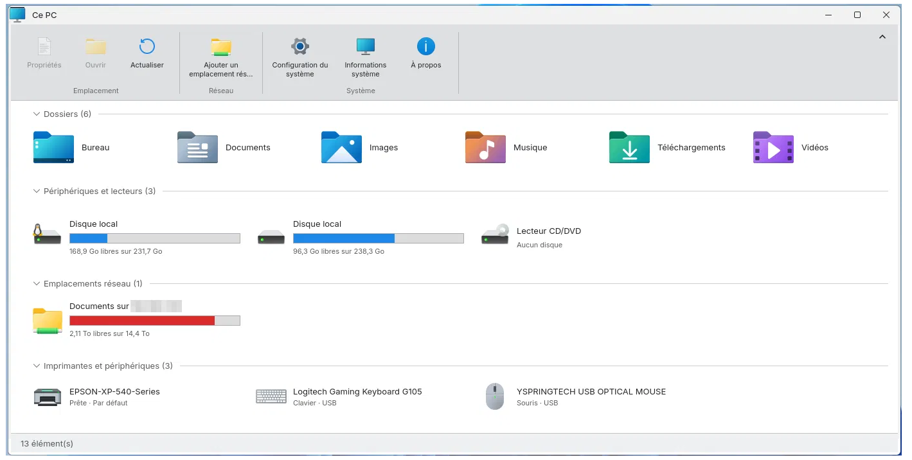

# Fenestra This PC

A "This PC" window for KDE Plasma 6, inspired by the Windows 11 view of the same name. Part of the Fenestra series.

It shows, in one window, your personal folders, your drives, your network locations, your printers and your input devices. It follows the colours and the icon theme of your Plasma desktop.



## Features

- **Folders**: Desktop, Documents, Pictures, Music, Downloads and Videos, opened in Dolphin.
- **Devices and drives**
  - Internal disks, USB sticks, memory cards and external disks, each with a usage gauge. The gauge turns red when less than 20 % of free space is left.
  - Your CD/DVD drive is always shown, even when empty, and it can be ejected.
  - Properties shows the disk health (SMART). USB volumes can be renamed.
- **Network locations**
  - Add an SMB share (NAS, another computer) with a button. You don't need a terminal or administrator rights.
  - The share shows its free space. Its password is kept in KWallet.
  - When the server is off, the share stays listed with a red badge.
- **Printers and devices**
  - Each printer shows its state (Ready, Printing, Offline), whether it is the default printer, and its ink levels.
  - The state reflects whether a network printer really answers, not only what CUPS believes.
  - A known printer that is switched off stays listed as Offline, and you can remove it from the list.
  - Keyboards, mice, touchpads, graphics tablets and game controllers are listed with their connection (USB, Bluetooth, built-in).
- **Command bar**: a simple Windows 11-style bar, or a full ribbon. Switch between them with the arrow on the right.
- **Window**: the window remembers its size, and the lists show instantly on opening.
- **Languages**: 13 languages, following your system language, with English as the fallback.

## Requirements

- KDE Plasma 6 (Qt 6), Wayland session. X11 is not supported.
- Python 3 with PyQt6, including the QtQml and QtQuick modules, and Kirigami.
- Required tools: `lsblk`, `udevadm`.
- Optional tools, each one enabling a feature:
  - `udisksctl` and `eject`: CD/DVD mounting and ejecting.
  - `smartctl` (smartmontools): disk health.
  - `smbclient`: network shares.
  - `lpstat` (CUPS): printers.
  - `ipptool` (CUPS IPP tools): ink levels.
  - `avahi-browse` (Avahi tools): real printer status.
  - `kwallet-query`: remembered passwords.

On Kubuntu 26.04 everything is already installed. The install script checks what is present before installing anything.

## Installation

**Option 1 — KDE Store.** Download the archive, extract it, then run the install script below.

**Option 2 — from this repository.** Download or clone it, then, in the folder:

```
bash install.sh
```

It installs for the current user only (no root needed):

- the program in `~/.local/bin/`;
- its icons and languages in `~/.local/share/fenestra/`;
- a "This PC" entry in the application menu;
- a desktop shortcut. Use `bash install.sh --no-desktop-icon` if you don't want it.

To remove it:

```
bash uninstall.sh            # keeps your settings
bash uninstall.sh --purge    # also removes settings and caches
```

## Appearance

This PC uses your Plasma colours and your icon theme, so its look changes with your theme: with another icon theme (Breeze, for example), it will look different from the screenshots. The screenshots were taken with the **windows-modern** icon theme from [Windows Modern for KDE Plasma 6](https://github.com/Jeysef/KDE-Windows-Modern) (by Jeysef, based on [Win11OS-kde](https://github.com/yeyushengfan258/Win11OS-kde) by yeyushengfan258), which is not included here.

## Languages

English, French, German, Spanish, Italian, Brazilian Portuguese, Dutch, Polish, Russian, Turkish, Japanese, Simplified Chinese and Traditional Chinese.

English and French are written by the author. The other languages were translated with the help of an AI and still need a review by native speakers. Corrections are welcome.

## Known limitations

- **Printer states come from CUPS.**
  - A printer detected automatically on the network is a temporary queue. It disappears when the printer is switched off, and CUPS then forgets that it was the default printer.
  - Installing the printer in *Printer Settings* gives a permanent queue that keeps this setting.
- **Real printer status needs `avahi-browse`.** Without it, the state shown is the one reported by CUPS.
- **Input devices:** only keyboards, mice, touchpads, graphics tablets and game controllers are listed. Screens, cameras and audio devices are not.
- **Tested on:** Solus (Plasma 6) and Kubuntu 26.04 LTS. Feedback from other distributions and other printer brands is welcome.

## Contents

| Path | Description |
|---|---|
| `ce_pc_plasma.py` | The program |
| `icons/` | Command bar icons (Fluent UI System Icons) and their licence |
| `locale/` | Translations (gettext `.po` and compiled `.mo`) |
| `install.sh` / `uninstall.sh` | Installation and removal for the current user |
| `COPYING` | GNU General Public License v3.0 |

## Credits

- This PC © 2026 naykkalak, Fenestra series.
- Command bar icons: Fluent UI System Icons © Microsoft Corporation, MIT licence (see `icons/`).
- Icon theme used for the screenshots: windows-modern, from [Windows Modern for KDE Plasma 6](https://github.com/Jeysef/KDE-Windows-Modern) by Jeysef, based on Win11OS-kde by yeyushengfan258. It is not included in this repository.

## Trademarks

This project is not affiliated with, endorsed by or sponsored by Microsoft Corporation. Windows is a trademark of Microsoft Corporation.

## License

This PC is licensed under the GNU General Public License v3.0 or later (GPL-3.0-or-later). See `COPYING`.

The icons in `icons/` keep their own MIT licence.
